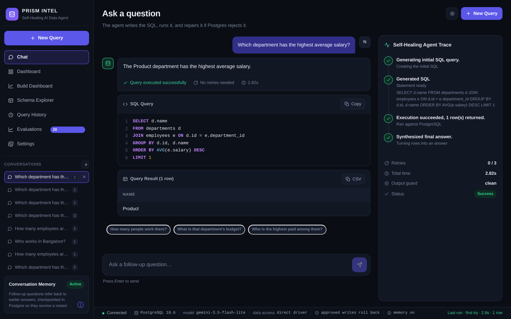
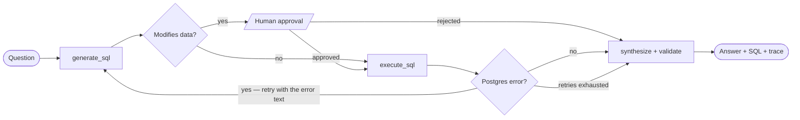
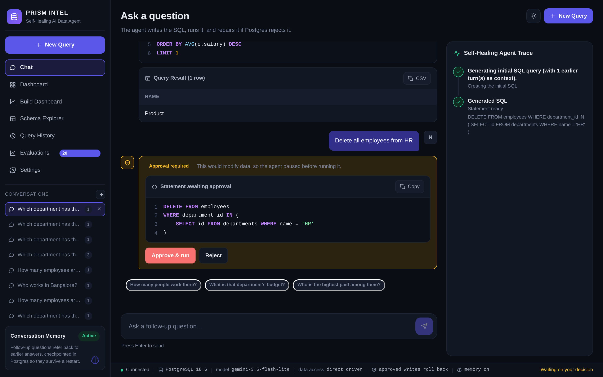
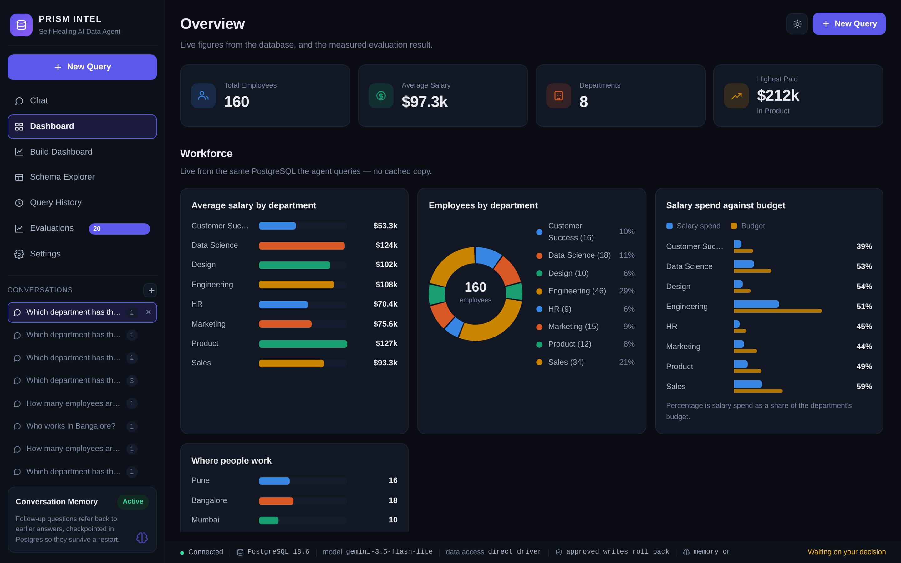
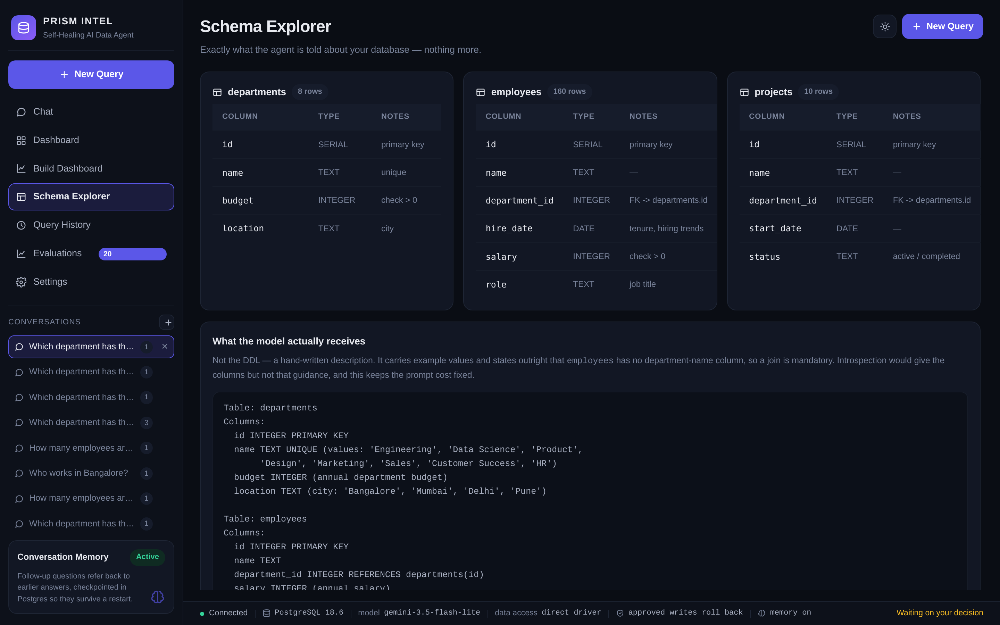

# PRISM INTEL — Self-Healing AI Data Agent

Ask a database a question in English. The agent writes the SQL, runs it, and **repairs its own query from the database's error message** — then validates its answer before showing it to you.

Most Text-to-SQL demos are a single LLM call: if the generated SQL is wrong, the user gets a stack trace. This one feeds the actual Postgres error back into the model and regenerates — up to three times — inside a cyclic LangGraph state machine.



---

## How it works



The retry edge is the whole project: the failed SQL **and** the database's error text go back into the prompt, so the second attempt is informed rather than a re-roll. Everything the agent did is returned to the UI as a step-by-step trace.

---

## Does the self-healing loop actually help?

Measured, not asserted — 20 questions with gold SQL, scored on **execution accuracy**, run with retries off and on. Only the schema description handed to the model changed between conditions; the questions, database and code were identical.

| Schema description | Retries off | Retries on | Delta | Avg retries |
|---|---|---|---|---|
| Production (hand-tuned) | 95% | 95% | **+0pp** | 0.00 |
| Degraded (bare column list) | 90% | 90% | **+0pp** | 0.00 |
| Stale (wrong column names) | 15% | **30%** | **+15pp** | 2.25 |

**The loop doubles accuracy — but only where queries actually fail.** With a well-tuned schema description the model never produced SQL that Postgres rejected, so the loop never fired and contributed exactly nothing. That negative result is published rather than hidden, because it locates precisely where the architecture earns its cost: schema drift, not prompt quality.

Full method, per-question breakdown and failure analysis: **[eval/RESULTS.md](eval/RESULTS.md)**.

---

## What else is in here

| Capability | What it does |
|---|---|
| **Human-in-the-loop approval** | A `DELETE`/`UPDATE`/`DROP` doesn't get refused — the graph *pauses* (`interrupt_before`) and shows you the exact statement. `ALLOW_WRITES` decides whether approving commits or runs-and-rolls-back. |
| **Conversation memory** | LangGraph `PostgresSaver` keyed by `thread_id`, so "how many people work *there*?" resolves. Survives a restart; fails open to stateless. |
| **Output validation** | A deterministic guard strips schema identifiers and leaked SQL from the final answer. The prompt is a request; this is the guarantee. |
| **MCP transport** | `USE_MCP=true` routes database access through an MCP server over stdio. The graph never knows which transport ran. |
| **AI-generated dashboards** | One sentence becomes several self-healed queries; each widget type is chosen from the *shape* of its result, not by another model call. Exports to Power BI (`.pbids` + Power Query M, DirectQuery). |
| **Live status bar** | Model, Postgres version, transport, write mode and memory state are read from the running process — never hard-coded into the UI. |

<table>
<tr>
<td width="50%"><br><em>The approval gate pauses on a destructive statement.</em></td>
<td width="50%"><br><em>Live figures from the same Postgres the agent queries.</em></td>
</tr>
</table>



---

## Run it

```bash
cp .env.example .env      # add your GOOGLE_API_KEY
docker compose up --build
```

Three containers come up — `db` (PostgreSQL 18), `backend` (FastAPI + agent), `frontend` (React via Nginx). Open **http://localhost** for the UI; Swagger is at `http://localhost:8000/docs`. If those ports are taken, set `BACKEND_PORT` / `FRONTEND_PORT` in `.env`.

```bash
# 69 tests — no API key, no database
docker build -f backend/Dockerfile.test -t sql-agent-test backend && docker run --rm sql-agent-test
```

---

## Stack

**LangGraph** `StateGraph` with conditional edges · **Gemini** via LangChain (`temperature=0`) · **FastAPI** · **PostgreSQL 18** (SQLAlchemy Core) · **React 18 + Vite** · **Docker Compose** · **LangSmith** tracing (opt-in) · **MCP** (optional transport)

## Documentation

| Document | Contents |
|---|---|
| **[PROJECT_WALKTHROUGH.md](docs/PROJECT_WALKTHROUGH.md)** | **Start here** — request flowchart, what was built in what order and why |
| [SETUP.md](docs/SETUP.md) | Running it locally, the dev loops, and every error this project hit |
| [TECHNICAL_SPEC.md](docs/TECHNICAL_SPEC.md) | Architecture and state schema |
| [CODE_NOTES.md](docs/CODE_NOTES.md) | Why each file and dependency exists |
| [CODE_QA.md](docs/CODE_QA.md) | Hard questions about specific lines, with answers |
| [TEXT_TO_SQL_FUNDAMENTALS.md](docs/TEXT_TO_SQL_FUNDAMENTALS.md) | The field this sits in — pipeline, metrics, benchmarks, interview prep |
| [INTERVIEW_NOTES.md](docs/INTERVIEW_NOTES.md) | Trade-offs, and the questions this design invites |
| [ROADMAP.md](docs/ROADMAP.md) | What is built, what is not, what is next — and what is refused |
| [BUILD_PLAN.md](docs/BUILD_PLAN.md) | How the build was run, and where the time actually went |
| [DEPLOYMENT.md](docs/DEPLOYMENT.md) | Free single-service deploy (Render + Neon) |

## Known limits

Stated here rather than discovered later:

- **Not deployed yet** — no live URL. Steps are checklisted at the top of [DEPLOYMENT.md](docs/DEPLOYMENT.md).
- **No authentication** — anyone holding a `thread_id` can read that conversation or approve a write on it.
- **Three tables** — a hand-written schema description stops scaling somewhere around thirty. Whether an error-informed retry loop still helps at that size is the next thing worth measuring, on [Spider](https://yale-lily.github.io/spider).
- **MCP talks to our own server** — the protocol's real payoff, pointing the same agent at a third-party server, has not been demonstrated.

---

Part of an **Agentic Self-Correcting Systems** portfolio alongside [Adaptive CRAG](../adaptive-crag) and [Code Guardian](../code-guardian) — the same idea (LLM + self-verification + autonomous correction) applied to SQL *execution errors*, retrieval *relevance*, and code *defects*.
