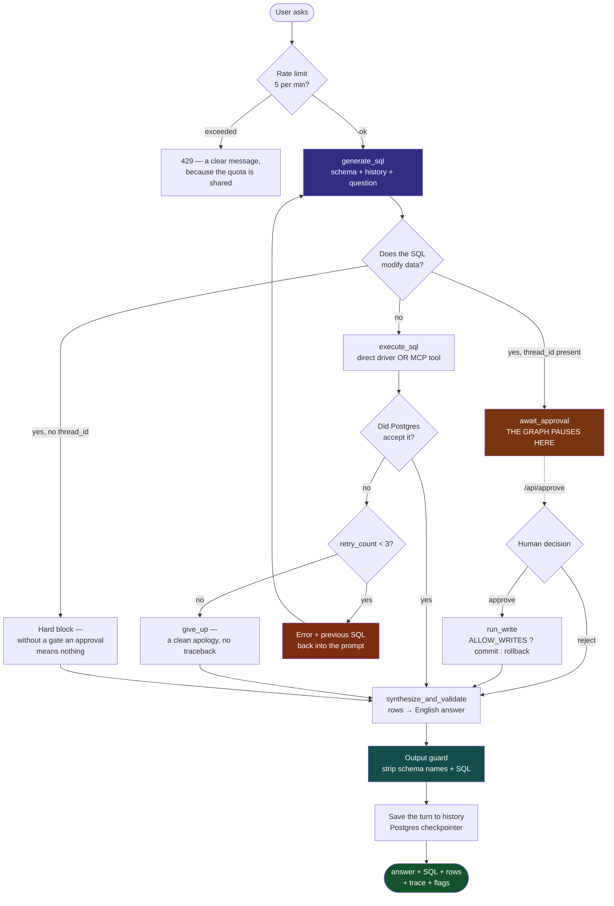

# Project Walkthrough — what was built, how, and how it works

This is the whole project **in one place**: the flowchart, what each step does and why,
and at the end how the complete system runs. If you only read one file, read this one.

What the other docs are for:
[TECHNICAL_SPEC](TECHNICAL_SPEC.md) architecture and design decisions ·
[CODE_NOTES](CODE_NOTES.md) file-by-file "why this exists" ·
[INTERVIEW_NOTES](INTERVIEW_NOTES.md) the pitch and Q&A ·
[eval/RESULTS](../eval/RESULTS.md) measured numbers ·
[DEPLOYMENT](DEPLOYMENT.md) how to take it live.

---

## 1. In one line

A natural-language question → SQL → and if the query fails, **the agent reads the
database error and fixes its own query** (up to 3 times) → an answer, with the full
trace visible to the user.

Most Text-to-SQL demos are a single LLM call: if the SQL is wrong, the user gets a
stack trace. **Here the database error is not a failure, it is a signal.**

---

## 2. The full journey of one question (flowchart)



**The red box is the whole project.** `FEED` — the error and the failed SQL going
back into the prompt — is the one thing that turns this from "retry" into "repair".

---

## 3. How it was built — step by step

For each step: **what was built · why · what broke · what it does now.**

### Step 1 — The base agent (a LangGraph state machine)

**What:** three nodes — `generate_sql` → `execute_sql` → `synthesize_and_validate`,
with a conditional edge `should_retry` in between.

**Why LangGraph and not a `for` loop:** a loop would retry, but the attempt history
would not be structured in a state object, each node could not be inspected
separately, and the HITL interrupt plus the checkpointer — both graph-level features
— would have demanded a full rewrite later. Both of those turned out to be genuinely
needed (Steps 6 and 7).

**What it does now:** `should_retry` reads the state at runtime and picks one of
three routes — `retry` (back to generate), `give_up`, or `success`. That is what
makes it a **cyclic** graph rather than a linear chain.

### Step 2 — Making the docs match the code

**What:** the README and spec said Groq + Llama + SQLite; the code was Gemini +
Postgres. Guardrails was written up as "implemented" when it was never wired at all.

**Why it matters:** an interviewer opens the README and the code. One wrong claim
casts doubt over everything else.

**Now:** every section is marked `[Implemented]` or `[Planned]`, and INTERVIEW_NOTES
carries an **honesty checklist** — what *not* to say.

### Step 3 — Two tables, with a foreign key

**What:** added `departments` (id, name, budget, location) and turned
`employees.department` TEXT into `department_id INTEGER REFERENCES departments(id)`.

**Why — this was not about looking complex:** on a flat table every question became
a single-table `WHERE` filter, which the model gets right on the first attempt almost
every time. That meant **the self-healing loop had nothing to heal** — the project's
core feature never fired in a demo.

**What broke (and what that gave):** `docker compose build` was failing outright —
`guardrails-ai==0.5.10` requires `langchain-core<0.3`, everything else requires
`>=0.3`. That dependency was not even being used. It was removed.

**Now:** answering "Who works in Bangalore?" forces the model to **infer the join** —
location lives on `departments`, and `employees` has no department name at all.

### Step 4 — The evaluation harness

**What:** 20 questions with gold SQL, run at `MAX_RETRIES=0` vs `3` to compare accuracy.

**The metric — execution accuracy:** both the gold and the agent query are executed
and their **result sets** compared. Not SQL string matching (one question has many
correct SQL forms), and not an LLM judge (that puts the reliability problem inside
an unmeasured component).

**What came out — and this is worth saying unprompted:**

| Condition | Retries off | Retries on | Delta | Avg retries |
|---|---|---|---|---|
| Production schema | 95% | 95% | **+0pp** | 0.00 |
| Degraded schema | 90% | 90% | **+0pp** | 0.00 |
| **Stale schema** | **15%** | **30%** | **+15pp** | 2.25 |

In the first two conditions **the loop never fired once**. With a good schema
description the model does not write a wrong query — so those runs were measuring
the **prompt**, not the architecture. Hence the third condition: a schema description
containing column names that do not exist (**schema drift**, the most common
breakage in real deployments). There Postgres returns
`HINT: Perhaps you meant "employees.name"`, that hint goes into the retry prompt, and
**accuracy doubles**.

**This 0% result was not hidden** — it is written up in full in
[eval/RESULTS.md](../eval/RESULTS.md).

### Step 5 — The frontend

**What:** a React + Vite app — chat, a live trace rail, dashboard, schema explorer,
query history, evaluations, settings.

**The trace rail is the most important part:** the project claims that the agent
reads an error and fixes its query — and a chat bubble showing only the final answer
is **exactly the view in which that claim becomes invisible.** A retry only exists on
screen if the failure is visible too.

**🐛 The best bug of the project came out of this testing.** "Delete all employees
from HR" was asked. Every data-touching layer behaved correctly — the guard allowed
only a SELECT, nothing in the data changed. Then the synthesizer answered: *"The
employees Anjali Nair and Vikram Singh have been removed from the HR department."*

Nothing had been removed. **The guard protected the data, the narration lied.** The
whole threat model had been about preventing an unauthorised *write*, and all those
layers worked — but a user told that a deletion happened is harmed all the same. The
fix is in the synthesis prompt.

> **Lesson:** guarding an action and guarding the **report** of that action are two
> separate responsibilities. And this gap only showed up in an end-to-end UI test —
> every individual component was working correctly.

### Step 6 — Conversation memory (Phase 4)

**What:** a LangGraph `PostgresSaver` checkpointer, per `thread_id`.

**Memory is two things, and both are needed:** the checkpointer makes state
*durable*; but until that state reaches **the prompt**, "how many of them are in
Bangalore?" is an incomplete sentence to the model. So `history` is in the state
*and* `_format_history()` puts it into the prompt.

Each turn's **SQL goes into the history too, not just the answer** — `GROUP BY d.name
ORDER BY AVG(e.salary) DESC LIMIT 1` tells the model what "them" refers to far more
precisely than the English answer does.

**The most delicate part — which state is per-turn and which is per-conversation:**
LangGraph merges new input **over** the checkpointed state, so any key not in the
input carries over from the previous turn. That is why `run_agent` explicitly resets
`retry_count`, `logs` and `error` on every question and leaves only `history`. Get
this wrong and the previous turn's two retries would push the next question straight
to "give up", with the previous question's lines showing in the trace.
**That single line is the difference between a memory feature and a memory bug.**

**Why Postgres and not `MemorySaver`:** on the free tier the container sleeps after
15 minutes; the user comes back, asks a follow-up, and the conversation is gone.
**Verified live:** the backend container was restarted and a third question asked on
the same thread — the history came back from Postgres.

### Step 7 — Human-in-the-loop approval (Phase 3)

**What:** a destructive statement is no longer blocked — the graph **pauses**, shows
the exact SQL, and continues via `/api/approve`.

**Two things learned while building it:**

**1. HITL is impossible without a checkpointer.** Pause and resume are two separate
HTTP requests, so the state has to be alive somewhere in between. That is why the
stateless path (no `thread_id`) keeps the old hard block — and that is not a gap, it
is **the right behaviour**: showing an approval prompt that cannot be honoured is
worse than refusing outright. **Phase 4 coming before Phase 3 was a precondition, not
a coincidence.**

**2. The whole phase had become dead code.** The system prompt said *"only ever write
SELECT queries"*. After building the gate it was tested — the model wrote a `SELECT`
and the gate was skipped. That constraint existed **because** there was no gate. That
line is now conditional on `hitl_enabled`.

> **Lesson:** a feature that passes because its code never runs has not been tested.

**`ALLOW_WRITES` — being approved and being committed are different.** At the default
`false`, an approved statement **still runs** (Postgres plans it, enforces the
constraints, reports the affected rows) and is then **rolled back**. That makes the
gate demonstrable on a public URL without handing any visitor the ability to empty a
table — and the response says plainly that it was rolled back. Not theatre.

This is also where the earlier bug reappeared **in the opposite direction**: the
hardcoded *"STRICTLY READ-ONLY"* in the synthesis prompt would, at
`ALLOW_WRITES=true`, report a genuine commit as "nothing changed". That is now
conditional too — **no false confirmation, and no false reassurance.**

### Step 8 — The output guard

**What:** `app/validators.py` — strips qualified identifiers (`employees.salary`),
schema-only column names (`department_id`) and leaked SQL out of the final answer;
whatever it finds is reported in `guardrail_flags`.

**Why not Guardrails AI — tried twice:** `<=0.5` requires `langchain-core<0.3`,
`>=0.6` requires `langchain-core>=1.0`. There is no version in between. Using it
would have meant a full langchain 1.x migration, breaking the checkpointer and graph
APIs — for the sake of one validator.

**And a deterministic check is better here anyway:** schema leakage is a *syntactic*
property — either the answer contains `employees.salary` or it does not. A job for a
regex, not for judgement. Adding another LLM turns a deterministic check into a
probabilistic one — **and then who would check that LLM?**

**The most important line: what is NOT flagged.** `salary`, `name`, `role`, `budget`
and `location` are in the schema and also in ordinary English. Catching those would
**break every correct answer.** That one decision is what keeps this validator usable.

### Step 9 — MCP (Phase 2)

**What:** `mcp_server/server.py` exposes the database as MCP tools (over stdio),
`app/data_access.py` picks the transport, and `USE_MCP` toggles it.

**What it buys:** data access is no longer an `import`, it is an **interface**. The
same agent could be pointed at a third-party MCP server tomorrow without changing a
line of the graph, and this server could be driven by any other MCP client.

**What it costs:** the MCP route will **always be slower** than the direct driver — a
subprocess, a JSON-RPC round trip, a serialization hop. Which is why it defaults to off.

**Three things that came out of it:**

1. **The error has to survive the transport.** The loop runs on Postgres error text.
   If the MCP tool raised an exception, that message would be lost and the loop would
   look like it was "running" while never firing. So the server returns
   `{"ok": false, "error": ...}` inside a **successful** tool result and
   `data_access` turns it back into an exception. It has its own test, because this
   failure would be **silent**.
2. **Bridging sync and async.** The MCP SDK is async, the graph nodes are sync. An
   `asyncio.run()` per call means a new subprocess per query. Making the whole stack
   async means rewriting the agent for the sake of one toggle. The third route was
   chosen: a background thread with its own event loop, the session opened once, and
   sync callers submitting work with `run_coroutine_threadsafe`.
3. **The transport must not decode the payload.** The first version treated every
   result as JSON and broke on `describe_schema` — which returns plain text.

**Fail-open was verified:** on the first attempt MCP 2.x had renamed `FastMCP` to
`MCPServer`. The client logged the reason, turned the toggle off, and carried on with
the direct driver — exactly as designed. The trace says `via MCP tool` **only** when
the call really went through MCP.

### Step 10 — A dashboard from one sentence (Phase 5)

**What:** "Create a dashboard showing salary and headcount by department" → the
request is broken into sub-questions, each question runs through **the same
self-healing agent**, and a widget is chosen for each result.

**Two decisions shape the whole thing:**

**1. The LLM plans the sub-questions, not the widgets.** The questions involve
judgement — there is no single right answer to "what should be asked about salary".
The widget does not: one row and one column = KPI, four categories = bar. That
follows from the **shape** of the data. Spending another LLM call on it would turn a
deterministic decision into a probabilistic one.

**2. Every sub-question goes through the full agent**, never a shortcut — so the
retry loop, the output guard and the approval gate all apply. A separate SQL path
would bypass all of it, and the least-watched route through the system would have the
least safety.

**🐛 A dataviz bug showed up in the very first real dashboard.** "Average salary by
department" got a **donut**. A donut says *"these are parts of a whole"* — but
averages do not add up; the sum of four departments' average salaries represents
nothing. **That chart was saying something about the data that was not true.**

Fix: a donut only when the measure is **additive** (`count`, `total`, `sum`,
`headcount`, `budget`), and never when it is `avg`/`rate`/`percent`. Guessing from
the name is not perfect, but when it guesses wrong the result is a **bar** — which is
always honest.

**The widget cap is 4:** each widget is a full agent run (1-2 LLM calls, more when it
retries), and the free tier gives ~15 req/min. Any higher and the first dashboard
would consume the whole quota.

### Step 11 — Power BI export (Phase 6)

**What:** two artifacts from a generated dashboard — a `.pbids` connection file, and
one Power Query (M) script per widget carrying the agent's generated SQL.

**This is not "Power BI integration", and calling it that would be wrong.**
Publishing a dataset into the service needs an Azure AD app registration, a tenant,
and workspace permissions — none of which this project has. The UI calls it an
**export** too. A button that implies an integration is the same kind of lie as a
chart that flatters its own data.

**Two decisions:**
- **DirectQuery, not Import** — Import would take a snapshot and the Power BI
  dashboard would drift silently out of date with this database.
- **Never credentials in the `.pbids`** — this file goes onto the user's disk. Power
  BI asks for credentials itself and keeps them in its own store. It has a dedicated
  test, because this is the same mistake as putting a real key in `.env.example`.

### Step 12 — Getting ready to deploy

- **A per-IP rate limit** — the Gemini free tier gives the whole project ~15 req/min,
  shared across every visitor. Without a limit, one bot kills the demo before an
  interview even starts. `/health` is deliberately exempt so the uptime pinger is
  never throttled.
- **A single-service image** — FastAPI serves the built React app itself. One URL, no
  CORS, one thing to deploy.
- **`render.yaml`** + [DEPLOYMENT.md](DEPLOYMENT.md) — Render + Neon + UptimeRobot.

---

## 4. How the whole system works now

### 4.1 Component map


### 4.2 The life of the state

`AgentState` has two halves, and the distinction **only came into existence with the
checkpointer**:

| Scope | Fields | Why |
|---|---|---|
| **Per-turn** (reset on every question) | `question`, `sql_query`, `query_result`, `error`, `retry_count`, `logs`, `result_rows`, `guardrail_flags`, `approval_status` | If the previous turn's retries and logs carried over, the next question would go straight to "give up" and the trace would be wrong |
| **Per-conversation** (carries over) | `history` | The entire basis of a follow-up |

There is **no additive reducer** on `history`: nodes return `{**state, ...}`, so every
node already returns the whole history — a reducer would re-append it at each node and
it would grow exponentially. Only `synthesize_and_validate` adds a turn: one place,
one time.

### 4.3 Safety — four layers

| Layer | What it prevents | Its limit |
|---|---|---|
| System prompt | The model writing a write it was not asked for | Bypassable by prompt injection |
| `is_destructive()` keyword guard | Catches it before the DB call | Substring match — conservative, it will also catch an `'updated'` literal |
| HITL approval gate | No write without a human | `thread_id` is unauthenticated |
| Output guard | Schema/SQL leaking into the answer | Does not enforce the per-person salary rule (it cannot tell those from aggregates) |

**The real production answer is none of these four:** a database-level read-only
role. That cannot be bypassed by prompt injection. These layers do not replace it.

### 4.4 What was verified

| | |
|---|---|
| **69 unit tests** | memory · approval gate · output guard · data access · widget selection · Power BI export. No API key or DB needed |
| Follow-up + restart | Restarted the container and asked a follow-up on the same thread — the history came back |
| HITL cycle | The gate paused · rejecting ran nothing · approving ran the statement and rolled back (2 rows reported, data intact) · approving again returned 409 |
| MCP round trip | schema, rows, dry-run write — and **the error message preserved with its HINT** |
| Full agent on MCP | `Execution succeeded via MCP tool` |
| Eval | 3 conditions, [the numbers](../eval/RESULTS.md) |
| Dashboard generation | One request → 4 widgets, correct types (kpi · donut · bar · table) |
| Power BI export | `.pbids` is valid JSON, DirectQuery, no credentials; SQL escaped in the M script |
| Images | test, backend, frontend, single-service — all build |

**What was NOT verified, and this should be said too:**
- The `ALLOW_WRITES=true` commit path was never run against the real DB — it would
  genuinely delete rows. It is covered by unit tests, not end to end.
- MCP only talks to **our own** server, not to any third-party MCP server.
- LangSmith is wired but not one trace has actually **been looked at** yet.

---

## 5. What is left

| # | Task | Time | Status |
|---|---|---|---|
| 1 | **Deploy it** — Neon → Render → UptimeRobot | ~40 min | Code and guide ready, only the accounts to create |
| 2 | **Look at one LangSmith trace** yourself | 5 min | Wired; do it before claiming it in an interview |
| 3 | Sync the docs after deploying (`⬜` → `✅`, live URL) | 5 min | — |

After the deploy, the project is complete. The full checklist is at the top of
[DEPLOYMENT.md](DEPLOYMENT.md).

> **No new features are needed.** What is left is presentation, not code — deploy it,
> and learn the eval story. An honest assessment of how strong this project is and
> where it is weak is in [INTERVIEW_NOTES §16](INTERVIEW_NOTES.md); answers to
> questions like "any AI could build this" are in the **Credibility** subsection of §10.

### Beyond that — and what comes first

**Evaluating on Spider.** The real limit of this project is not the realism of the
data, it is **the size of the schema**. Three tables are small enough that a
hand-written description fits comfortably in the prompt — and that description is
doing a lot of work: it names the join key and states plainly that a join is
required. At around thirty tables that stops being possible, and the agent has to do
**schema retrieval** first.

[Spider](https://yale-lily.github.io/spider) is the academic Text-to-SQL benchmark and
its **gold queries are already labelled** — meaning the harness needs a loader, not a
rewrite. It would answer the question this eval cannot: **does the retry loop still
help on a schema that large, or do the failures shift from syntactic to semantic**
(valid SQL answering the wrong question) — where the loop is structurally blind.

> **This is a measurement, not a feature.** Which is exactly why it comes before
> everything else. And saying "I evaluated on Spider" in an interview carries more
> weight than any new feature.

**The rest (a roadmap, not a promise):** a database-level read-only role · auth on the
approve endpoint plus a per-user thread namespace · a separate mechanism for semantic
failures, because the loop only catches *execution* errors.

### Why the data is synthetic

The rows are generated, not imported — and that is the basis of the eval.
`random.Random(42)` is fixed, so every machine produces the same 160 employees.
Without that, the numbers above could not be compared between runs at all: a change
in accuracy and a change in the data would look identical.

The schema was also **designed** for the task rather than **taken** from somewhere:
`employees` deliberately has no department name, salary bands are tied to roles, and
manager roles are rare. Most public HR datasets are a flat CSV — that removes the
join, and with it the class of error this loop repairs.

---

## 6. Quick reference

### Commands

```bash
docker compose up --build            # the whole stack
docker compose up -d db backend      # API only

# tests (69) — no API key and no database needed
docker build -f backend/Dockerfile.test -t sql-agent-test backend
docker run --rm sql-agent-test

# eval — real LLM calls, spends quota
docker compose run --rm --no-deps -v "$PWD/eval:/app/eval" \
  backend python -m eval.run_eval --stale-schema
```

### Endpoints

| Endpoint | Job |
|---|---|
| `POST /api/query` | Question → answer + SQL + rows + trace |
| `POST /api/approve` | Resume a paused conversation (409 if nothing is pending) |
| `POST /api/dashboard` | One sentence → several widgets, each a full agent run |
| `POST /api/dashboard/export` | Dashboard → `.pbids` + Power Query scripts |
| `GET /api/schema` | Columns, row counts, and the exact text the model sees |
| `GET /api/stats` | Dashboard aggregates |
| `GET /api/meta` | What this instance is running — model, transport, retry budget, write mode, memory. Feeds the status bar |
| `GET /health` | Platform healthcheck + uptime ping (outside the rate limiter) |

### Env vars that change behaviour

| Var | Default | Effect |
|---|---|---|
| `GEMINI_MODEL` | `gemini-3.5-flash-lite` | If a model is deprecated, change it here, not in the code |
| `MAX_RETRIES` | `3` | The eval sets it to `0` to isolate what the loop contributes |
| `ALLOW_WRITES` | `false` | Whether an approved write commits or runs and rolls back |
| `USE_MCP` | `false` | Database through MCP tools or through the direct driver |
| `DASHBOARD_MAX_WIDGETS` | `4` | Each widget is a full agent run — the cap protects the quota |
| `DISABLE_CHECKPOINTER` | unset | Memory off — **and the HITL gate with it**, because an interrupt needs a checkpointer |
| `RATE_LIMIT_REQUESTS` | `5` | Per IP, per window |

### The files that matter most

| File | What |
|---|---|
| `backend/app/nodes.py` | The nodes themselves — prompts, execution, retry decision, HITL |
| `backend/app/graph.py` | The wiring — edges, the interrupt, `run_agent` / `resume_agent` |
| `backend/app/state.py` | `AgentState`, and the per-turn vs per-conversation scoping |
| `backend/app/data_access.py` | Direct driver or MCP — the graph cannot tell |
| `backend/app/checkpointer.py` | Conversation memory, lazy + fail-open |
| `backend/app/validators.py` | The output guard |
| `backend/mcp_server/server.py` | The database as MCP tools |
| `backend/app/dashboard.py` | Request → sub-questions → widgets (from shape, not from an LLM) |
| `backend/app/powerbi.py` | Power BI export artifacts |
| `eval/run_eval.py` | The execution-accuracy harness |
| `frontend/src/chat/TracePanel.jsx` | The view that **makes** self-healing visible |
