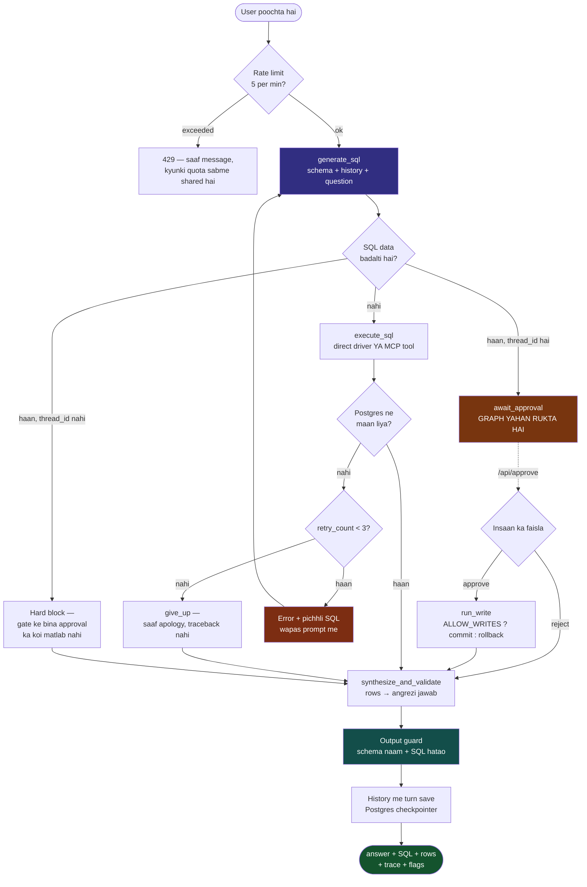
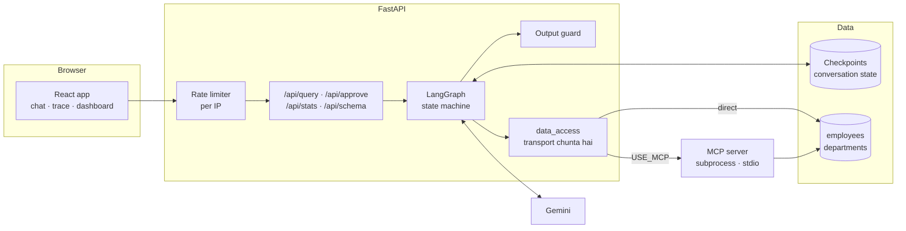

# Project Walkthrough — kya bana, kaise bana, aur kaam kaise karta hai

Ye **ek jagah** par poora project hai: flowchart, har step ka kaam aur uska kaaran,
aur end me ye ki poora system chalta kaise hai. Agar sirf ek file padhni ho, ye padho.

Baaki docs kis liye hain:
[TECHNICAL_SPEC](TECHNICAL_SPEC.md) architecture aur design decisions ·
[CODE_NOTES](CODE_NOTES.md) file-by-file "ye kyun hai" ·
[INTERVIEW_NOTES](INTERVIEW_NOTES.md) pitch aur Q&A ·
[eval/RESULTS](../eval/RESULTS.md) measured numbers ·
[DEPLOYMENT](DEPLOYMENT.md) live kaise karein.

---

## 1. Ek line me

Natural language sawaal → SQL → agar query fail ho to **database ka error padh kar
agent khud query sudhaarta hai** (3 baar tak) → jawab, aur poora trace user ko dikhta hai.

Zyadatar Text-to-SQL demos ek LLM call hote hain: SQL galat hui to user ko stack
trace milta hai. **Yahan database ka error failure nahi, ek signal hai.**

---

## 2. Ek sawaal ka poora safar (flowchart)



**Lal wala box hi poora project hai.** `FEED` — error aur failed SQL wapas prompt me
jaana — wahi ek cheez hai jo ise "retry" se "repair" banati hai.

---

## 3. Kaam kaise hua — step by step

Har step: **kya banaya · kyun · kya toota · ab kya karta hai.**

### Step 1 — Base agent (LangGraph state machine)

**Kya:** teen nodes — `generate_sql` → `execute_sql` → `synthesize_and_validate`,
aur beech me ek conditional edge `should_retry`.

**Kyun LangGraph, `for` loop nahi:** loop se retry ho jaata, par attempt history
state object me structured nahi hoti, har node alag se inspect nahi hota, aur
HITL interrupt + checkpointer — dono graph-level features — baad me poora rewrite
maangte. Wo dono aage sach me chahiye pade (Step 6 aur 7).

**Ab kya karta hai:** `should_retry` runtime pe state padh ke teen me se ek raasta
chunta hai — `retry` (wapas generate pe), `give_up`, ya `success`. Yahi ise
**cyclic** graph banata hai, linear chain nahi.

### Step 2 — Docs code se match karwaye

**Kya:** README/spec me likha tha Groq + Llama + SQLite; code me Gemini + Postgres tha.
Guardrails "implemented" jaisa likha tha jabki wire hi nahi hua tha.

**Kyun zaroori:** interviewer README kholega aur code bhi. Ek galat claim baaki
sab par shak daal deti hai.

**Ab:** har section `[Implemented]` ya `[Planned]` marked hai, aur
INTERVIEW_NOTES me ek **honesty checklist** hai — kya *nahi* bolna.

### Step 3 — Do tables, foreign key ke saath

**Kya:** `departments` (id, name, budget, location) add ki, aur `employees.department`
TEXT ko `department_id INTEGER REFERENCES departments(id)` bana diya.

**Kyun — ye sirf "complex lagne" ke liye nahi tha:** flat table pe har sawaal ek
single-table `WHERE` filter ban jaata tha, jo model lagbhag hamesha pehli baar me
sahi kar leta. Matlab **self-healing loop ko heal karne ke liye kuch milta hi nahi
tha** — project ka core feature demo me kabhi trigger hi nahi hota.

**Kya toota (aur mila):** `docker compose build` hi fail ho rahi thi —
`guardrails-ai==0.5.10` `langchain-core<0.3` maangta hai, baaki sab `>=0.3`.
Wo dependency use bhi nahi ho rahi thi. Hata di.

**Ab:** "Who works in Bangalore?" ke liye model ko **join infer** karna padta hai —
location `departments` pe hai, `employees` me department ka naam hai hi nahi.

### Step 4 — Evaluation harness

**Kya:** 20 questions + gold SQL, aur `MAX_RETRIES=0` vs `3` chala kar accuracy compare.

**Metric — execution accuracy:** gold aur agent dono ki query chalti hai, **result
sets** compare hote hain. SQL string match nahi (ek sawaal ke kai sahi SQL hote
hain), LLM judge nahi (wo reliability problem ko ek unmeasured component me daal
deta).

**Kya mila — aur ye khud se bolne wali baat hai:**

| Condition | Retries off | Retries on | Delta | Avg retries |
|---|---|---|---|---|
| Production schema | 95% | 95% | **+0pp** | 0.00 |
| Degraded schema | 90% | 90% | **+0pp** | 0.00 |
| **Stale schema** | **15%** | **30%** | **+15pp** | 2.25 |

Pehli do conditions me **loop ek baar bhi fire nahi hua**. Achhe schema description
ke saath model galat query likhta hi nahi — to wo runs **prompt** measure kar rahe
the, architecture nahi. Isliye teesri condition banayi: schema description me aise
column names jo exist hi nahi karte (**schema drift**, real deployments ka sabse
common breakage). Wahan Postgres `HINT: Perhaps you meant "employees.name"` deta
hai, wo hint retry prompt me jaata hai, aur **accuracy double ho jaati hai**.

**Ye 0% result chhupaya nahi gaya** — [eval/RESULTS.md](../eval/RESULTS.md) me poora likha hai.

### Step 5 — Frontend

**Kya:** React + Vite app — chat, live trace rail, dashboard, schema explorer,
query history, evaluations, settings.

**Trace rail sabse zaroori hissa hai:** project ka daawa ye hai ki agent error padh
kar query sudhaarta hai — aur sirf final answer dikhane wala chat bubble **theek
wahi view hai jisme ye daawa invisible ho jaata hai.** Retry screen pe tabhi exist
karta hai jab failure bhi dikhe.

**🐛 Isi testing me sabse achha bug mila.** "Delete all employees from HR" poocha.
Har data-touching layer sahi chali — guard ne SELECT hi chalne di, data nahi badla.
Phir synthesizer ne jawab diya: *"The employees Anjali Nair and Vikram Singh have
been removed from the HR department."*

Kuch remove nahi hua tha. **Guard ne data bacha liya, narration ne jhooth bol diya.**
Poora threat model unauthorised *write* rokne pe tha, aur wo saari layers kaam kar
gayi — lekin jis user ko bataya jaye ki deletion ho gayi, uska nuksaan waise hi
hota hai. Fix synthesis prompt me hai.

> **Sabak:** action ko guard karna aur us action ki **report** ko guard karna do
> alag zimmedariyaan hain. Aur ye gap sirf end-to-end UI test se mila — har
> component alag-alag sahi kaam kar raha tha.

### Step 6 — Conversation memory (Phase 4)

**Kya:** LangGraph `PostgresSaver` checkpointer, per `thread_id`.

**Memory do cheezein hai, aur dono chahiye:** checkpointer state ko *durable*
banata hai; par jab tak wo state **prompt me** na jaye, model ke liye "unme se
kitne Bangalore me hain?" ek adhoora vaakya hai. Isliye `history` state me hai
*aur* `_format_history()` use prompt me daalta hai.

History me har turn ka **SQL bhi jaata hai, sirf answer nahi** — `GROUP BY d.name
ORDER BY AVG(e.salary) DESC LIMIT 1` model ko "unme se" ka referent angrezi jawab
se kahin zyada precisely batata hai.

**Sabse nazuk hissa — kaunsi state per-turn hai aur kaunsi per-conversation:**
LangGraph naye input ko checkpointed state ke **upar merge** karta hai, to jo key
input me nahi hai wo pichhle turn se carry ho jaati hai. Isliye `run_agent` har
sawaal pe `retry_count`, `logs`, `error` sab explicitly reset karta hai aur sirf
`history` chhodta hai. Ye galat hota to pichhle turn ki do retries agle sawaal ko
turant "give up" pe dhakel deti aur trace me purane sawaal ki lines dikhti.
**Yahi ek line memory feature aur memory bug ka farak hai.**

**Postgres kyun, `MemorySaver` nahi:** free tier pe container 15 min me sota hai;
user wapas aake follow-up poochta aur conversation gayab. **Live verify hua:**
backend container restart karke usi thread me teesra sawaal chala — history
Postgres se wapas aayi.

### Step 7 — Human-in-the-loop approval (Phase 3)

**Kya:** destructive statement ab block nahi hoti — graph **rukta hai**, exact SQL
dikhata hai, `/api/approve` se aage badhta hai.

**Do cheezein build karte waqt pata chali:**

**1. HITL checkpointer ke bina possible hi nahi.** Pause aur resume do alag HTTP
requests hain, to state beech me kahin zinda chahiye. Isliye stateless path (bina
`thread_id`) purana hard block hi rakhta hai — aur ye gap nahi, **sahi behaviour**
hai: aisa approval prompt dikhana jise honour hi nahi kiya ja sakta, seedha refuse
karne se bura hai. **Phase 4 ka Phase 3 se pehle aana precondition tha, ittefaq nahi.**

**2. Poora phase dead code ban gaya tha.** System prompt kehta tha *"only ever write
SELECT queries"*. Gate banane ke baad maine test kiya — model ne `SELECT` likh diya,
gate skip ho gaya. Wo constraint **isliye** thi kyunki gate nahi tha. Ab wo line
`hitl_enabled` pe conditional hai.

> **Sabak:** ek feature jo isliye pass ho raha hai kyunki uska code kabhi chalta hi
> nahi — wo test hua hi nahi.

**`ALLOW_WRITES` — approve hona aur commit hona alag hai.** Default `false` pe
approved statement **phir bhi chalta hai** (Postgres plan karta hai, constraints
enforce karta hai, affected rows batata hai) aur phir **rollback** ho jaata hai.
Isse gate public URL pe demo ho sakta hai bina kisi visitor ko table khaali karne
ki taakat diye — aur response me saaf likha hota hai ki rollback hua. Dikhava nahi.

Yahin apna hi purana bug **ulti direction me** dobara mila: synthesis prompt me
hardcoded *"STRICTLY READ-ONLY"* `ALLOW_WRITES=true` pe ek asli commit ko "kuch
nahi badla" batata. Ab wo bhi conditional hai — **na jhoothi confirmation, na
jhoothi tasalli.**

### Step 8 — Output guard

**Kya:** `app/validators.py` — final answer se qualified identifiers
(`employees.salary`), schema-only column names (`department_id`), aur leak hui SQL
nikaal deta hai; jo mila wo `guardrail_flags` me report hota hai.

**Guardrails AI kyun nahi — do baar koshish ki:** `<=0.5` `langchain-core<0.3`
maangta hai, `>=0.6` `langchain-core>=1.0`. Beech me koi version hai hi nahi.
Use karne ke liye poora langchain 1.x migration chahiye tha, jo checkpointer aur
graph APIs tod deta — sirf ek validator ke liye.

**Aur yahan deterministic check behtar bhi hai:** schema leakage ek *syntactic*
baat hai — jawab me `employees.salary` likha hai ya nahi. Regex ka kaam hai,
judgement ka nahi. Ek aur LLM lagana matlab deterministic check ko probabilistic
bana dena — **aur us naye LLM ko kaun check karta?**

**Sabse important line: kya flag NAHI hota.** `salary`, `name`, `role`, `budget`,
`location` schema me bhi hain aur aam angrezi me bhi. Inhe pakadna **har sahi
jawab tod deta.** Yahi ek faisla is validator ko istemaal ke laayak rakhta hai.

### Step 9 — MCP (Phase 2)

**Kya:** `mcp_server/server.py` database ko MCP tools ki tarah expose karta hai
(stdio pe), `app/data_access.py` transport chunta hai, `USE_MCP` toggle karta hai.

**Kya milta hai:** data access ab `import` nahi, ek **interface** hai. Wahi agent
kal kisi third-party MCP server se juda ja sakta hai bina graph ka ek line badle,
aur ye server kisi doosre MCP client se chalaya ja sakta hai.

**Kya lagta hai:** MCP raasta seedhe driver se **hamesha slower** rahega — ek
subprocess, JSON-RPC round trip, serialization hop. Isliye default off hai.

**Teen cheezein jo isme mili:**

1. **Error transport se bach kar aana chahiye.** Loop Postgres ke error text par
   chalta hai. MCP tool agar exception raise karta to wo message hi kho jaata aur
   loop "chalta hua" dikhta par kabhi fire na hota. Isliye server
   `{"ok": false, "error": ...}` ko **successful** tool result me bhejta hai aur
   `data_access` use wapas exception me badalta hai. Iske liye alag test hai,
   kyunki ye failure **chup-chaap** hoti.
2. **Sync aur async ka mel.** MCP SDK async hai, graph nodes sync. Har call pe
   `asyncio.run()` matlab har query pe naya subprocess. Poora stack async karna
   matlab ek toggle ke liye agent ka rewrite. Chuna gaya teesra raasta: ek
   background thread jisme apna event loop ho, session ek baar khule, aur sync
   callers `run_coroutine_threadsafe` se kaam bhejein.
3. **Transport ko payload decode nahi karna chahiye.** Pehla version har result ko
   JSON maanta tha aur `describe_schema` par toot gaya — wo plain text deta hai.

**Fail-open verify hua:** pehli koshish me MCP 2.x ne `FastMCP` ka naam `MCPServer`
kar diya tha. Client ne wajah log ki, toggle off kiya, aur direct driver pe chalta
raha — bilkul jaisa design tha. Trace me `via MCP tool` **tabhi** likha aata hai
jab sach me MCP se gaya ho.

### Step 10 — Dashboard ek vaakya se (Phase 5)

**Kya:** "Create a dashboard showing salary and headcount by department" → request
sub-questions me tootti hai, har sawaal **usi self-healing agent** se chalta hai,
aur har result ke liye widget chuna jaata hai.

**Do faisle jo poora dhaancha tay karte hain:**

**1. Sub-questions LLM banata hai, widgets nahi.** Sawaal me judgement hai —
"salary ke baare me kya poochha jaana chahiye" ka koi ek jawab nahi. Widget me
judgement nahi hai: ek row ek column = KPI, chaar categories = bar. Wo data ki
**shakl** se tay hota hai. Uske liye ek aur LLM call lagana ek deterministic
faisle ko probabilistic bana dena hai.

**2. Har sub-question poore agent se guzarta hai**, kisi chhote raaste se nahi —
matlab retry loop, output guard, approval gate sab lagte hain. Alag SQL path hota
to wo sab bypass ho jaata, aur system ke sabse kam dekhe jaane wale raaste par
sabse kam safety hoti.

**🐛 Pehle hi asli dashboard me ek dataviz bug nikla.** "Average salary by
department" ko **donut** mil gaya. Donut kehta hai *"ye hisse ek poore ke hain"* —
par averages jodte nahi; chaar departments ke average salary ka yog kisi cheez ko
represent nahi karta. **Wo chart data ke baare me ek baat kah raha tha jo sach
nahi thi.**

Fix: donut sirf tab jab measure **jodne layak** ho (`count`, `total`, `sum`,
`headcount`, `budget`), aur kabhi nahi jab wo `avg`/`rate`/`percent` ho. Naam se
andaza perfect nahi hai, par galat hone par nateeja **bar** hai — jo hamesha
imaandaar rehta hai.

**Widget cap 4 hai:** har widget ek poora agent run hai (1-2 LLM calls, retry pe
aur zyada), aur free tier ~15 req/min deta hai. Zyada rakhne se pehla hi dashboard
poora quota kha jaata.

### Step 11 — Power BI export (Phase 6)

**Kya:** generated dashboard se do artifacts — ek `.pbids` connection file, aur
har widget ke liye ek Power Query (M) script jisme agent ki generated SQL hai.

**Ye "Power BI integration" nahi hai, aur use aisa kehna galat hoga.** Service me
dataset publish karne ke liye Azure AD app registration, ek tenant, aur workspace
permissions chahiye — teeno is project ke paas nahi hain. UI me bhi ise **export**
hi likha hai. Ek button jo integration ka bharam de, wo usi kism ka jhooth hai
jaisa ek chart jo apne data ko flatter kare.

**Do faisle:**
- **DirectQuery, Import nahi** — Import ek snapshot bana deta aur Power BI wala
  dashboard is database se chupchaap purana hota jaata.
- **`.pbids` me credentials kabhi nahi** — ye file user ke disk par jaati hai.
  Power BI khud credentials maangta hai aur apne store me rakhta hai. Iske liye
  ek alag test hai, kyunki ye wahi galti hai jo `.env.example` me asli key daalne
  se hui thi.

### Step 12 — Deploy ke liye taiyari

- **Per-IP rate limit** — Gemini free tier poore project ko ~15 req/min deta hai,
  sab visitors me shared. Bina limit ke ek bot demo ko interview se pehle hi maar
  deta. `/health` deliberately exempt hai, taaki uptime pinger throttle na ho.
- **Single-service image** — FastAPI hi built React serve karta hai. Ek URL, koi
  CORS nahi, ek cheez deploy karni hai.
- **`render.yaml`** + [DEPLOYMENT.md](DEPLOYMENT.md) — Render + Neon + UptimeRobot.

---

## 4. Poora system ab kaam kaise karta hai

### 4.1 Component map



### 4.2 State ka jeevan

`AgentState` ke do hisse hain, aur ye farak **checkpointer aane ke baad** paida hua:

| Scope | Fields | Kyun |
|---|---|---|
| **Per-turn** (har sawaal pe reset) | `question`, `sql_query`, `query_result`, `error`, `retry_count`, `logs`, `result_rows`, `guardrail_flags`, `approval_status` | Pichhle turn ki retries/logs carry ho jaayein to agla sawaal turant "give up" pe chala jaata aur trace galat dikhta |
| **Per-conversation** (carry hoti hai) | `history` | Follow-up ka poora aadhaar yahi hai |

`history` par **koi additive reducer nahi** hai: nodes `{**state, ...}` return karte
hain, to har node poori history wapas bhejta hai — reducer lagate to har node pe
dobara jud kar exponentially badhti. Sirf `synthesize_and_validate` ek turn add
karta hai, ek jagah, ek baar.

### 4.3 Safety — chaar layers

| Layer | Kya rokta hai | Iski seema |
|---|---|---|
| System prompt | Model ko bina kahe write likhne se | Prompt injection se bypass ho sakta hai |
| `is_destructive()` keyword guard | DB call se pehle pakadta hai | Substring match — conservative, `'updated'` literal bhi pakad lega |
| HITL approval gate | Insaan ke bina koi write nahi | `thread_id` unauthenticated hai |
| Output guard | Answer me schema/SQL leak | Per-person salary rule enforce nahi karta (aggregates se alag nahi kar sakta) |

**Asli production answer chaaron se alag hai:** database-level read-only role. Wo
prompt injection se bypass ho hi nahi sakta. Ye layers uski jagah nahi lete.

### 4.4 Kya verify hua

| | |
|---|---|
| **69 unit tests** | memory · approval gate · output guard · data access · widget selection · Power BI export. Koi API key ya DB nahi chahiye |
| Follow-up + restart | Container restart karke usi thread me follow-up chala — history wapas aayi |
| HITL cycle | Gate ruka · reject pe kuch nahi chala · approve pe statement chala aur rollback hua (2 rows report, data intact) · dobara approve pe 409 |
| MCP round trip | schema, rows, dry-run write — aur **error message HINT ke saath preserve** |
| Full agent on MCP | `Execution succeeded via MCP tool` |
| Eval | 3 conditions, [numbers](../eval/RESULTS.md) |
| Dashboard generation | Ek request → 4 widgets, sahi types (kpi · donut · bar · table) |
| Power BI export | `.pbids` valid JSON, DirectQuery, credentials nadarad; M script me SQL escaped |
| Images | test, backend, frontend, single-service — sab build hoti hain |

**Jo verify NAHI hua, aur ye bhi likha hona chahiye:**
- `ALLOW_WRITES=true` wala commit path asli DB pe nahi chalaya — wo sach me rows
  delete karta. Unit test se covered hai, end-to-end nahi.
- MCP sirf **apne** server se baat karta hai, kisi third-party MCP server se nahi.
- LangSmith wired hai par ek bhi trace **dekha nahi gaya** hai abhi tak.

---

## 5. Aage kya bacha hai

| # | Kaam | Time | Status |
|---|---|---|---|
| 1 | **Deploy karna** — Neon → Render → UptimeRobot | ~40 min | Code + guide ready, sirf accounts banane hain |
| 2 | LangSmith pe **ek trace khud dekhna** | 5 min | Wired hai; interview me claim karne se pehle dekh lena |
| 3 | Deploy ke baad docs sync (`⬜` → `✅`, live URL) | 5 min | — |

Deploy ke baad project complete hai. Poori checklist
[DEPLOYMENT.md](DEPLOYMENT.md) ke top pe hai.

> **Naye features ki zaroorat nahi hai.** Ab jo bacha hai wo presentation hai, code
> nahi — deploy, aur eval wali story ratt lena. Is project ki taakat kitni hai aur
> kahan kamzor hai, uska imaandaar assessment
> [INTERVIEW_NOTES §16](INTERVIEW_NOTES.md) me hai; aur "koi bhi AI ye bana deta
> hai" jaise sawaalon ke jawab §10 ke **Credibility** subsection me.

**Iske aage jo ho sakta hai (roadmap, promise nahi):** database-level read-only
role · approve endpoint pe auth aur per-user thread namespace · bade schema ke liye
schema retrieval (50 tables ki description prompt me fit nahi hogi) · semantic
failures ke liye ek alag mechanism, kyunki loop sirf *execution* errors pakadta hai.

---

## 6. Quick reference

### Chalane ke commands

```bash
docker compose up --build            # poora stack
docker compose up -d db backend      # sirf API

# tests (46) — na API key chahiye, na database
docker build -f backend/Dockerfile.test -t sql-agent-test backend
docker run --rm sql-agent-test

# eval — asli LLM calls, quota kharch hoti hai
docker compose run --rm --no-deps -v "$PWD/eval:/app/eval" \
  backend python -m eval.run_eval --stale-schema
```

### Endpoints

| Endpoint | Kaam |
|---|---|
| `POST /api/query` | Sawaal → answer + SQL + rows + trace |
| `POST /api/approve` | Ruki hui conversation ko resume (409 agar kuch pending nahi) |
| `POST /api/dashboard` | Ek vaakya → kai widgets, har ek poore agent se |
| `POST /api/dashboard/export` | Dashboard → `.pbids` + Power Query scripts |
| `GET /api/schema` | Columns, row counts, aur wahi text jo model ko jaata hai |
| `GET /api/stats` | Dashboard aggregates |
| `GET /health` | Platform healthcheck + uptime ping (rate limit se bahar) |

### Env vars jo behaviour badalte hain

| Var | Default | Asar |
|---|---|---|
| `GEMINI_MODEL` | `gemini-3.5-flash-lite` | Model deprecate ho to yahan badlo, code me nahi |
| `MAX_RETRIES` | `3` | Eval ise `0` karke loop ka contribution isolate karta hai |
| `ALLOW_WRITES` | `false` | Approved write commit ho ya chal ke rollback |
| `USE_MCP` | `false` | Database MCP tools se ya seedha driver se |
| `DASHBOARD_MAX_WIDGETS` | `4` | Har widget ek poora agent run hai — cap quota bachata hai |
| `DISABLE_CHECKPOINTER` | unset | Memory band — **aur iske saath HITL gate bhi**, kyunki interrupt ko checkpointer chahiye |
| `RATE_LIMIT_REQUESTS` | `5` | Per IP, per window |

### Files jo sabse zyada matter karti hain

| File | Kya |
|---|---|
| `backend/app/graph.py` | Poora state machine — nodes, edges, prompts, HITL |
| `backend/app/data_access.py` | Direct driver ya MCP — graph ko farak nahi padta |
| `backend/app/checkpointer.py` | Conversation memory, lazy + fail-open |
| `backend/app/validators.py` | Output guard |
| `backend/mcp_server/server.py` | Database as MCP tools |
| `backend/app/dashboard.py` | Request → sub-questions → widgets (shape se, LLM se nahi) |
| `backend/app/powerbi.py` | Power BI export artifacts |
| `eval/run_eval.py` | Execution-accuracy harness |
| `frontend/src/TracePanel.jsx` | Wo view jo self-healing ko **dikhata** hai |
